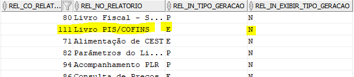
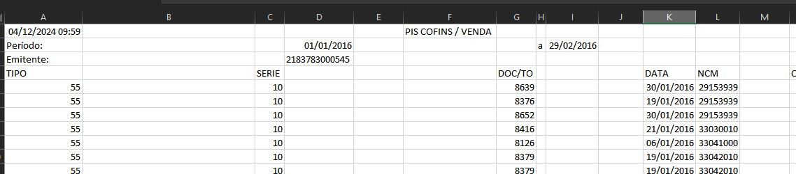
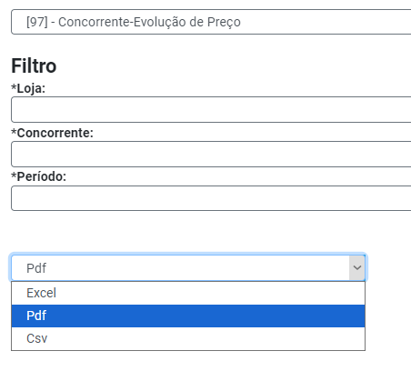

Adaíza solicitou revisão na geração dos relatórios 111 e 129. Ao gerar um relatório por exemplo: Prudente (464) / 01/07/2024 - 30/07/2024 São mais de 120 mil linhas mas o arquivo xlsx fica muito lento. Em alguns testes, mesmo gerando sem nenhuma formatação o problema continua.

Dessa forma penso em duas possibilidades:

1. Atualizar a versão do jasper. Hoje usamos a 5.6.0 e já estão na versão 7.0.0 O iReport não acompanha mais essa versão, teria que usar o editor JasperReports Studio. O Teste foi muito bom, usando 6.21.3. Arquivo xlsx gerado com menor tamanho e muito rápido para abrir. Mas tem que confirmar se dá pra usar essa versão do jasper com java 8
    
2. Não mexer na versão do jasper e colocar outra forma de exportação além de PDF e Excel, seria CSV Dessa forma cria um arquivo simples e elas importam no excel que já vai criar com os filtros e deve resolver essa lentidão

---

Fiz a atualização das bibliotecas do JasperReport para a versão 6.21 e adicionado também suas dependências, depois de alterar o código com as novas regras das classes foi feito o teste para gerar o relatório.

##### Falhas
- Atualizar o JasperReport não resultou em nenhuma melhoria considerável, foi gerado um arquivo de cada um dos relatórios mencionados usando o CNPJ de Avaré Loja 1, com o período de 01/01/2016 até 29/02/2016, com cerca de 110mil linhas, tais arquivos demoraram cerca de 10 minutos para abrir pelo excel. 
- Outras tentativas foram realizadas, como remover as bordas das células para diminuir elementos que o excel carregava ao abrir o arquivo, também sem sucesso.
##### Sucessos
- Por ultimo, usando ainda o JasperReport 6.21, foi alterado o tipo de arquivo para ser gerado como .csv, essa alternativa fez o arquivo abrir quase sem atraso (questão de menos de 10 segundos)
- Feito tambem a importação do arquivo para o Excel para ver se não prejudicava na forma como os dados eram exibidos ao serem importados, nenhum dado foi comprometido, e a ação foi quase imediata, com exceção de se tratar de um arquivo de texto, então não importou com bordas das células

---
#### Conclusão minha

O ideal no caso seria adicionar a opção de .csv na geração do arquivo, pelo menos nos casos de relatórios que são muito grandes, e orientar nesses casos a fazer a importação para o Excel.

Ao usar essa abordagem pode ser feito a atualização do Jasper para a versão 6.21 ou mantida a versão 5.6 que está no sistema

---
Criado uma condição onde caso o relatório tenha por padrão o tipo de geração em Excel e não permita escolher outro tipo de geração, ainda assim será possível escolher entre Excel e Csv (o formato PDF não será exibido).

REL_IN_TIPO_GERACAO = tipo padrão de geração (E = Excel)
REL_IN_EXIBIR_TIPO_GERACAO = permite mudar o tipo, anteriormente entre PDF e Excel

Agora os relatórios 111 e 129 terão o seguinte campo:

O texto de ajuda embaixo da seleção é uma sugestão, apenas para o usuário estar ciente da melhor forma de gerar relatórios grandes como os mencionados na descrição da issue.

Foi testado a geração dos relatórios em CSV e exportados para excel, sem perda de dados, quebra na formatação ou colunas desalinhadas. os headers foram mantidos mas sem estilização:

a geração em CSV tambem pode ser incluída nos demais relatórios que possuem tipo de geração com PDF tambem

