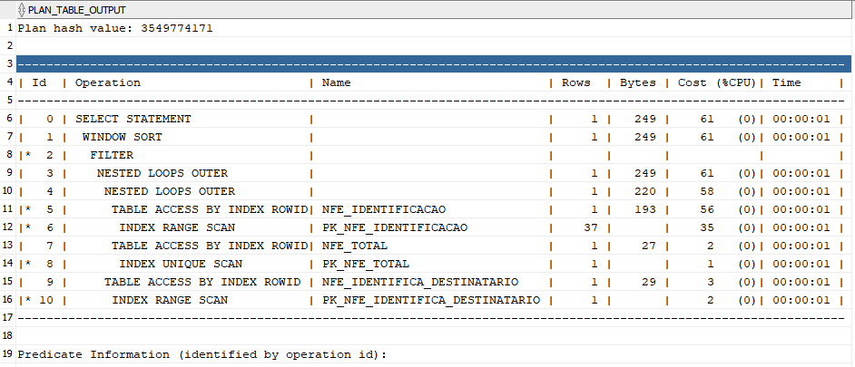
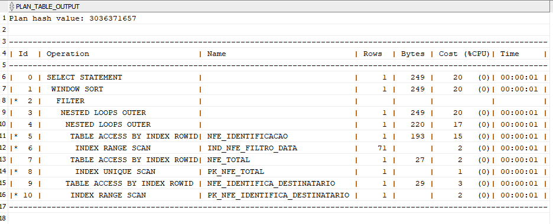
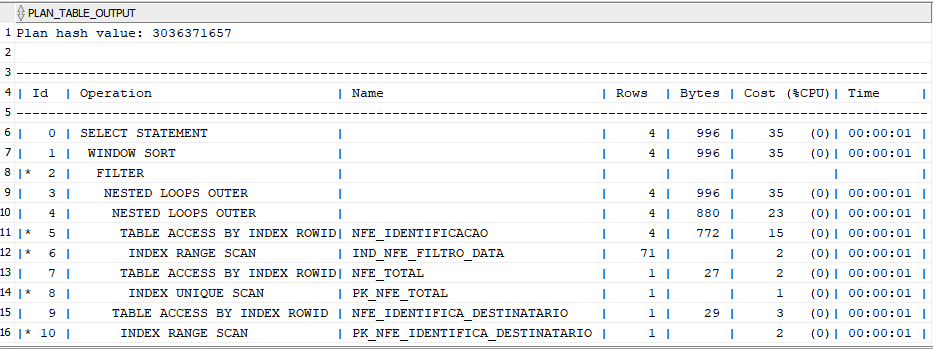

# Select's usados
#### Select Antigo
O primeiro select é a antiga forma de comparação usado em outros casos do sistema, comparando o 1 com o retorno do case. Foi incluído a data como filtro para a comparação fazer sentido.

``` sql
Explain plan for
SELECT
	SUB_NFE_IDENTIFICACAO.*,
	Nvl(SUB_NFE_TOTAL.NFT_VL_TOTAL_NFE, 0) AS vlTotalNfe,
	COUNT(*) OVER() AS totalLinhas
FROM
	(
		SELECT
			nfe.*
		FROM
			NFE_IDENTIFICACAO nfe
			LEFT JOIN NFE_IDENTIFICA_DESTINATARIO dest
			on(
			nfe.EMI_CO_CNPJ = dest.EMI_CO_CNPJ
			and nfe.NID_CO_NFE = dest.NID_CO_NFE
			and nfe.UNF_CO_SERIE = dest.UNF_CO_SERIE
			and nfe.UNF_CO_Modelo = dest.UNF_CO_Modelo)
		WHERE
		nfe.EMI_CO_CNPJ = 2183783000111
		AND 1 = (
			CASE
				WHEN -1 = -1 THEN 1
				WHEN -1 = dest.PTC_CO_CNPJ THEN 1
				ELSE 0
			END
		)
		and nfe.NID_IN_AMBIENTE = 1
		and 1 = (
			CASE
				when '-1' = '-1' then 1
				when '-1' = nfe.NID_IN_Status then 1
				else 0
			end
		)
		and 1 = (
			CASE
				when -1 = -1 then 1
				when -1 = nfe.NID_CO_NFE  then 1
				else 0
			end
		)
		and 1 = (
			CASE
				when -1 = -1 then 1
				when -1 = nfe.ope_Co_Operacao  then 1
				else 0
			end
		)
		and nfe.NID_DT_EMISSAO BETWEEN 
		TO_DATE('01/08/2024', 'DD/MM/YYYY') AND 
		TO_DATE('15/12/2024', 'DD/MM/YYYY')
	) SUB_NFE_IDENTIFICACAO
	LEFT JOIN (
		SELECT
			NFE_TOTAL.*
		FROM
			NFE_TOTAL
		WHERE
			EMI_CO_CNPJ = 2183783000111
	) SUB_NFE_TOTAL ON (
	SUB_NFE_IDENTIFICACAO.EMI_CO_CNPJ = SUB_NFE_TOTAL.EMI_CO_CNPJ
	AND SUB_NFE_IDENTIFICACAO.UNF_CO_MODELO = SUB_NFE_TOTAL.UNF_CO_MODELO
	AND SUB_NFE_IDENTIFICACAO.UNF_CO_SERIE = SUB_NFE_TOTAL.UNF_CO_SERIE
	AND SUB_NFE_IDENTIFICACAO.NID_CO_NFE = SUB_NFE_TOTAL.NID_CO_NFE
	AND SUB_NFE_IDENTIFICACAO.NID_IN_AMBIENTE = SUB_NFE_TOTAL.NID_IN_AMBIENTE
	)
ORDER BY
	SUB_NFE_IDENTIFICACAO.nid_Dt_Emissao DESC,
	SUB_NFE_IDENTIFICACAO.unf_Co_Modelo ASC,
	SUB_NFE_IDENTIFICACAO.unf_Co_Serie ASC,
	SUB_NFE_IDENTIFICACAO.nid_Co_Nfe DESC;
	
SELECT * FROM TABLE(DBMS_XPLAN.DISPLAY);
```

#### Select Novo
Usando a coluna a esquerda para assim dar preferência ao uso de índice.

``` sql
explain plan for
SELECT
    SUB_NFE_IDENTIFICACAO.*,
    Nvl(SUB_NFE_TOTAL.NFT_VL_TOTAL_NFE, 0) AS vlTotalNfe,
    COUNT(*) OVER() AS totalLinhas
FROM
    (
        SELECT
            nfe.*
        FROM
            NFE_IDENTIFICACAO nfe
            LEFT JOIN NFE_IDENTIFICA_DESTINATARIO dest on(
                nfe.EMI_CO_CNPJ = dest.EMI_CO_CNPJ
                and nfe.NID_CO_NFE = dest.NID_CO_NFE
                and nfe.UNF_CO_SERIE = dest.UNF_CO_SERIE
                and nfe.UNF_CO_Modelo = dest.UNF_CO_Modelo
            )
        WHERE
		NVL(dest.PTC_CO_CNPJ, -1) = (
			CASE
				WHEN -1 = -1 THEN NVL(dest.PTC_CO_CNPJ, -1)
				else -1
			END
		)
		and nfe.EMI_CO_CNPJ = 2183783000111
		
		and nfe.NID_IN_AMBIENTE = 1
		and nfe.NID_IN_STATUS = (
			CASE
				WHEN '-1' = '-1' THEN nfe.NID_IN_STATUS
				else '-1'
			END
		)
		and nfe.NID_CO_NFE = (
			CASE
				WHEN -1 = -1 THEN nfe.NID_CO_NFE
				else -1
			END
		)
		and nfe.ope_Co_Operacao = (
			CASE
				WHEN -1 = -1 THEN nfe.ope_Co_Operacao
				else -1
			END
		)
		and nfe.NID_DT_EMISSAO BETWEEN TO_DATE('01/08/2024', 'DD/MM/YYYY')
		AND TO_DATE('15/12/2024', 'DD/MM/YYYY')
    ) SUB_NFE_IDENTIFICACAO
    LEFT JOIN (
        SELECT
            NFE_TOTAL.*
        FROM
            NFE_TOTAL
        WHERE
            EMI_CO_CNPJ = 2183783000111
    ) SUB_NFE_TOTAL ON (
        SUB_NFE_IDENTIFICACAO.EMI_CO_CNPJ = SUB_NFE_TOTAL.EMI_CO_CNPJ
        AND SUB_NFE_IDENTIFICACAO.UNF_CO_MODELO = SUB_NFE_TOTAL.UNF_CO_MODELO
        AND SUB_NFE_IDENTIFICACAO.UNF_CO_SERIE = SUB_NFE_TOTAL.UNF_CO_SERIE
        AND SUB_NFE_IDENTIFICACAO.NID_CO_NFE = SUB_NFE_TOTAL.NID_CO_NFE
        AND SUB_NFE_IDENTIFICACAO.NID_IN_AMBIENTE = SUB_NFE_TOTAL.NID_IN_AMBIENTE
    )
ORDER BY
    SUB_NFE_IDENTIFICACAO.nid_Dt_Emissao DESC,
    SUB_NFE_IDENTIFICACAO.unf_Co_Modelo ASC,
    SUB_NFE_IDENTIFICACAO.unf_Co_Serie ASC,
    SUB_NFE_IDENTIFICACAO.nid_Co_Nfe DESC;
    
SELECT * FROM TABLE(DBMS_XPLAN.DISPLAY);
```

---
# Sem Índice
#### Select Antigo
Plano de explicação retornado:


---


#### Select Novo
Plano de explicação retornado:


---
# Com o Índice
Nesse caso foi criado o índice através do comando 
```sql
create index ind_Nfe_filtro_data on NFE_IDENTIFICACAO(NID_DT_EMISSAO);
```
#### Select Antigo
Plano de explicação retornado:


#### Select Novo
Plano de explicação retornado:
