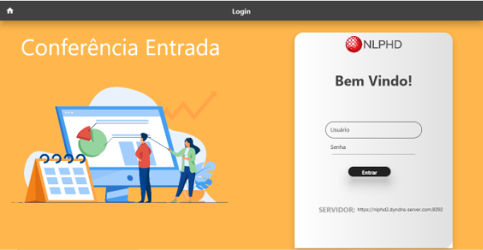
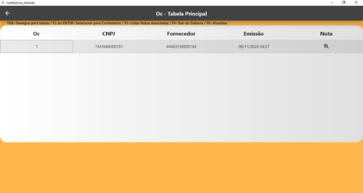
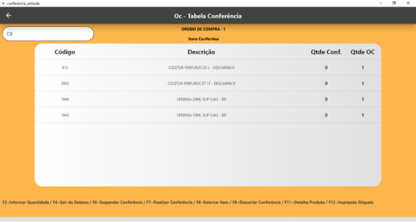
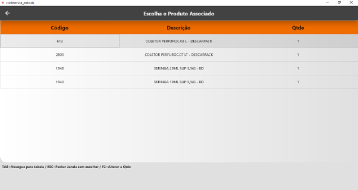
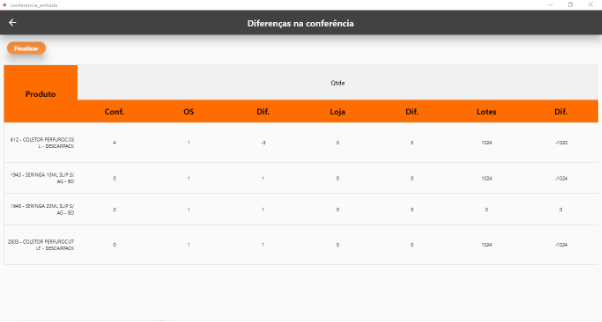

**Conferência de Entrada**

**Tela de Login:**

Na tela de login, o usuário deve inserir suas credenciais e selecionar a URL de acesso. Para isso, basta clicar no botão **"Servidor"**, onde será possível digitar manualmente a URL ou selecionar uma das opções disponíveis na lista de servidores cadastrados.

**Tela Principal:**

Na tela principal, é exibida uma lista de OCs disponíveis para conferência. O usuário pode navegar pela lista utilizando o teclado ou o mouse, selecionar a OC desejada e abri-la para conferência.

Os atalhos de teclado disponíveis estão destacados acima da tabela, conforme abaixo:

- **F2/ENTER**: Abre a conferência da OC selecionada (também pode ser aberto com um clique do mouse).
- **F3**: Abre a janela com as notas associadas à OC selecionada.
- **F4**: Fecha a aplicação.
- **F6**: Atualiza a lista de OCs.

**Tela de Conferência:**
` `Na tela de conferência, o usuário pode utilizar tanto o leitor de código de barras quanto o teclado para inserir os códigos.

As funções do teclado nesta tela são:

- **F2**: Informa a quantidade diretamente no produto desejado para evitar múltiplas leituras.
- **F4**: Exibe as opções de saída da conferência.
- **F6**: Suspende a OC.
- **F7**: Finaliza a OC.
- **F8**: Estorna um item informando o código de barras do item.
- **F9**: Descarta a conferência.
- **F11**: Exibe os detalhes do produto.

- **Se o código de barras estiver associado a um produto**: A quantidade correspondente será automaticamente inserida no campo "Quantidade Conferida" do produto.
- **Se o código de barras não estiver associado a nenhum produto**: A tela de associação será aberta automaticamente, permitindo que o usuário selecione o produto correspondente e informe a quantidade desejada.

Caso a conferência seja finalizada com diferenças nas quantidades, o usuário será levado até a **tela de diferenças**, onde poderá:

- Retornar para ajustar as quantidades.
- Finalizar a conferência com diferenças, caso tenha permissão para isso.

